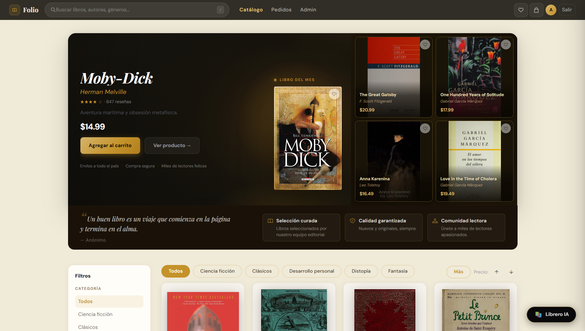
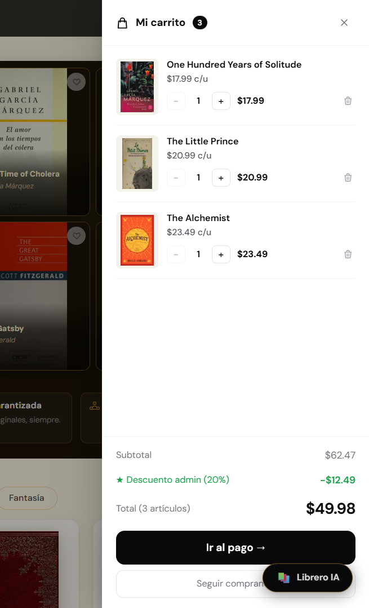
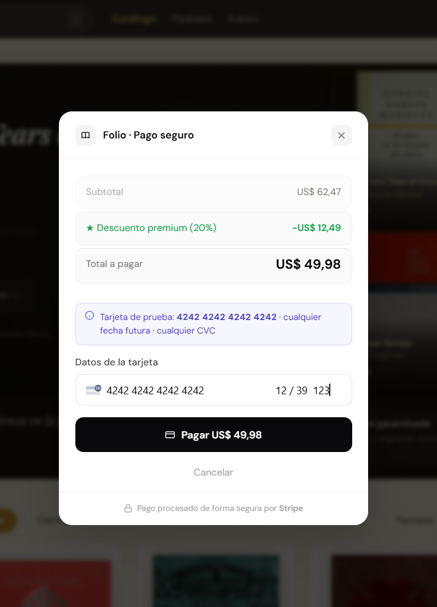
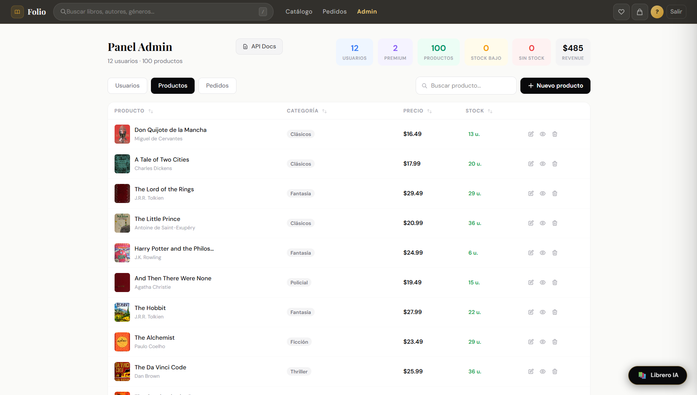
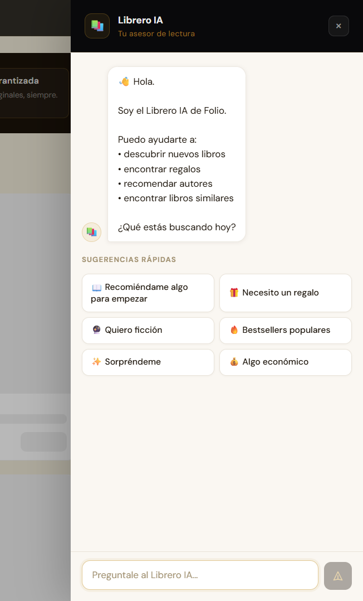

<div align="center">

  <h1>📚 Folio</h1>

  <p><strong>Full-stack bookstore with AI concierge, guest checkout, and Stripe payments</strong><br/>
  Built with React 19 · Node.js · MongoDB · TypeScript · Stripe</p>

  <p>
    
    
    
    
    
    
    
    
    
  </p>

  <p>
    <a href="https://folio-bookstore-two.vercel.app"><strong>→ Live Demo</strong></a>
    &nbsp;·&nbsp;
    <a href="https://folio-bookstore-pepj.onrender.com/api/docs"><strong>API Docs (Swagger)</strong></a>
    &nbsp;·&nbsp;
    <a href="#quick-start"><strong>Run Locally</strong></a>
  </p>

</div>

---

## Live Demo

| | |
|:---|:---|
| 🌐 **Frontend** | [folio-bookstore-two.vercel.app](https://folio-bookstore-two.vercel.app) |
| 📄 **API Docs (Swagger)** | [folio-bookstore-pepj.onrender.com/api/docs](https://folio-bookstore-pepj.onrender.com/api/docs) |

### Demo credentials

| Role | Email | Password |
|:---|:---|:---|
| Admin | admin@folio.com | Folio2024! |
| Premium | premium@folio.com | Folio2024! |
| User | user@folio.com | Folio2024! |

You can also **buy without an account** using the guest cart — no login required.

### Stripe test cards

| Card | Number |
|:---|:---|
| Visa | `4242 4242 4242 4242` |
| Mastercard | `5555 5555 5555 4444` |
| Visa Debit | `4000 0566 5566 5556` |

> Any future expiry · any CVC · any zip code.

> ⚠️ **Demo Mode is active on the live site.** A single env flag (`DEMO_MODE=true`) blocks all admin *write* operations — creating/editing/deleting products, changing roles, deleting users — to protect the sample data. Everything else (browsing, cart, checkout, AI concierge, reading the admin panel) works end to end.

---

## Product Demo

<p align="center">
  
</p>

<p align="center">
  <a href="https://youtu.be/xoBVVPC_0cI">
    ▶ Watch Full Demo (1 minute)
  </a>
</p>

---

## Showcase

| Home | Catalog |
|:---:|:---:|
|  |  |

| Cart | Checkout |
|:---:|:---:|
|  |  |

| Admin Dashboard | AI Concierge |
|:---:|:---:|
|  |  |

---

## Highlights

|  |  |  |  |
|:---|:---|:---|:---|
| ✅ Guest Checkout | ✅ Stripe Payments | ✅ AI Librarian | ✅ Admin Dashboard |
| ✅ OAuth (Google + GitHub) | ✅ Premium Membership | ✅ Wishlist | ✅ Swagger API |
| ✅ Responsive Design | ✅ SEO Ready | ✅ MongoDB | ✅ Demo Mode |

---

## Overview

Folio is a production-grade bookstore application built as a full-stack portfolio project. It covers the full e-commerce lifecycle: catalog browsing, AI-powered recommendations, cart management, Stripe payments, and an admin panel for inventory and user management.

Key differentiators: **guest checkout** with a cart that persists in localStorage and merges on login, a **Stripe PaymentIntent** flow with server-side price cross-check and full idempotency on guest confirm, **Folio Concierge** — an AI assistant that interprets natural language and queries the real MongoDB catalog at zero external API cost — and a **Demo Mode** middleware that blocks admin mutations behind a single env flag, so the live deployment stays safe for public browsing.

---

## Features

### Store Experience
- Paginated catalog with category, price, and stock filters
- Full-text search across title, author, and category
- Category tab bar (mobile) and sidebar (desktop)
- Recently viewed books and related products (localStorage)
- Wishlist with persistence across sessions
- Share product via Web Share API (mobile) or clipboard fallback (desktop)
- SEO: `<title>`, Open Graph, Twitter Card, canonical URL, Schema.org JSON-LD on product pages

### Authentication
- Email + password (bcrypt, min 6 chars, registration validation)
- GitHub OAuth
- Google OAuth
- Password reset via email token (UUID v4, 1-hour expiry, single-use)

### Checkout
- **Authenticated users** — cart persisted in MongoDB
- **Guest users** — cart in localStorage, auto-merged on login
- Quantity selector with stock validation before payment

### Payments
- Stripe `PaymentIntent` with `Elements` (no redirect)
- DB price ↔ Stripe amount cross-check (prevents client-side manipulation)
- Idempotent guest confirm — a `paymentIntentId` generates exactly one ticket

### Admin
- User management: view, change roles, delete, clean inactive accounts
- Product management: create, edit, delete, inline stock editing
- Order history with total revenue
- Protected by `adminOnly` middleware + Demo Mode

### AI Concierge
Natural-language book recommendations powered by a custom intent engine over MongoDB — no external API calls, no cost.

- Floating button available on every page
- Detects 15+ intents: genre (fiction, sci-fi, thriller…), price range, gift, beginner level, surprise, bestsellers
- Returns real in-stock books from the catalog with cover thumbnails
- Sidebar panel on desktop, full-screen on mobile
- Dedicated page at `/concierge`
- AI-ready: swap `AI_MODE=demo` for `openai` or `anthropic` in one env variable

### Security
- `helmet` (HTTP headers), `express-mongo-sanitize` (NoSQL injection), `express-rate-limit`
- Rate limiting on: login, password reset email, cart creation, Concierge chat
- Session-based auth with MongoStore, CORS locked to `APP_URL`
- Demo Mode: `DEMO_MODE=true` blocks all write operations in the admin

### Developer Experience
- Swagger API documentation at `/api/docs`
- Winston structured logging (console + file)
- Repository → DAO pattern decouples services from Mongoose
- TypeScript on the frontend, ESM throughout the backend
- One env flag toggles Demo Mode, another swaps the AI provider

---

## Tech Stack

| Layer | Technology |
|:---|:---|
| **Frontend** | React 19, TypeScript 6, Vite 8, React Router 7 |
| **Styling** | Tailwind CSS 4, CSS Modules, Framer Motion |
| **Backend** | Node.js 20 (ESM), Express 4 |
| **Database** | MongoDB Atlas, Mongoose 7, mongoose-paginate-v2 |
| **Auth** | express-session, connect-mongo, Passport.js (local + GitHub + Google OAuth) |
| **Payments** | Stripe PaymentIntent API, @stripe/react-stripe-js |
| **Security** | Helmet, CORS, express-mongo-sanitize, express-rate-limit |
| **Email** | Nodemailer (Gmail App Password) |
| **Logging** | Winston (console + file) |
| **API Docs** | swagger-jsdoc, swagger-ui-express |
| **Deploy** | Render (unified backend + frontend) |

---

## Architecture

```
folio-bookstore/
├── app.js                         # Entry point — binds Express to port
├── server.js                      # Express app: middlewares, routes, Swagger, static
│
├── src/
│   ├── config/
│   │   ├── index.config.js        # All environment variables
│   │   └── passport.config.js     # GitHub & Google OAuth strategies
│   │
│   ├── routes/                    # Express routers (thin — no logic)
│   │   ├── auth.js                # /auth — login, register, OAuth, users
│   │   ├── products.js            # /api/products — catalog CRUD
│   │   ├── carts.js               # /api/carts — authenticated cart
│   │   ├── guest.js               # /api/guest — guest checkout
│   │   ├── concierge.js           # /api/concierge — AI chat
│   │   └── mockingProducts.js     # /api/mockingProducts — dev only (Faker)
│   │
│   ├── controllers/               # Request handlers
│   │   ├── userManager.js         # Auth, roles, password reset
│   │   ├── productManager.js      # Product CRUD + email on delete
│   │   ├── cartManager.js         # Cart operations
│   │   ├── stripeManager.js       # PaymentIntent, confirm, tickets
│   │   └── conciergeController.js # Concierge chat handler
│   │
│   ├── services/                  # Business logic layer
│   │   └── ai/
│   │       ├── aiService.js       # AI_MODE router (demo / openai / anthropic)
│   │       └── demoProvider.js    # Intent detection + MongoDB search + reply builder
│   │
│   ├── repositories/              # Repository pattern over DAOs
│   ├── daos/                      # MongoDB access (Mongoose)
│   ├── models/                    # Mongoose schemas
│   │   ├── products.model.js
│   │   ├── users.model.js
│   │   ├── carts.model.js
│   │   └── tickets.model.js
│   │
│   ├── DTOs/                      # Data transfer objects
│   ├── middlewares/
│   │   ├── index.js               # authMiddleware, adminOnly, premiumOnly
│   │   ├── demoMode.js            # Blocks mutations when DEMO_MODE=true
│   │   └── errors/index.js        # Global error handler
│   │
│   └── utils/
│       ├── logger.js              # Winston
│       ├── mail.js                # Nodemailer transporter
│       └── roles.js               # isUserAdmin, isUserPremium
│
└── client/                        # React 19 + TypeScript + Vite
    └── src/
        ├── App.tsx                # Routes with lazy loading + Suspense
        ├── pages/                 # Products, ProductDetail, Admin, Login…
        ├── components/            # Navbar, CartDrawer, BookCard, Hero…
        │   └── concierge/         # ConciergeButton, ConciergePanel, ConciergeMessage
        ├── context/               # UserContext, GuestCartContext, FavoritesContext…
        ├── hooks/                 # useFavorites, useRecentlyViewed, useSEO…
        └── utils/                 # shareProduct.ts
```

**Request flow:**
```
Browser → React SPA
         → fetch('/api/...')
         → Express middleware stack (helmet → CORS → rate limit → session → demo mode)
         → Router → Controller → Service → Repository → DAO → MongoDB Atlas
```

---

## Role & Discount System

| Role | Discount | Can create/delete products |
|:---|:---|:---|
| `user` | 0% | No |
| `premium` | 10% | Own products only |
| `admin` | 20% | All products |

---

## Quick Start

### Prerequisites
- Node.js 20+
- MongoDB Atlas account (or local MongoDB)
- Stripe account (test keys)

### Setup

```bash
# Clone
git clone https://github.com/Napster135/folio-bookstore.git
cd folio-bookstore

# Install backend dependencies
npm install

# Install frontend dependencies
npm --prefix client install

# Configure environment
cp .env.example .env
# Edit .env with your values (see table below)

# Start backend (port 8080)
npm run dev

# Start frontend dev server (port 5173) — separate terminal
npm run dev:client
```

Open [http://localhost:5173](http://localhost:5173).

### Seed the database (optional)

```bash
# Create test users (admin / premium / user)
node scripts/create-test-admin.js

# Then import the catalog via MongoDB Compass or Atlas Data Import:
# scripts/catalogo_100_libros_premium_usd_con_portadas.json
```

---

## Environment Variables

Copy `.env.example` to `.env`:

| Variable | Required | Description |
|:---|:---:|:---|
| `PORT` | ✓ | Server port (default `8080`) |
| `NODE_ENV` | ✓ | `development` or `production` |
| `APP_URL` | ✓ | Public server URL — used for CORS and OAuth callbacks |
| `DB_URL` | ✓ | MongoDB Atlas connection string |
| `SECRET_KEY` | ✓ | Session signing secret (min 32 chars in production) |
| `STRIPE_SECRET_KEY` | ✓ | Stripe secret key (`sk_test_...`) |
| `STRIPE_PUBLIC_KEY` | ✓ | Stripe publishable key (`pk_test_...`) |
| `DEMO_MODE` | ✓ | `true` blocks admin mutations — safe for public demos |
| `AI_MODE` | ✓ | `demo` (default, no cost) · `openai` · `anthropic` |
| `GMAIL` | Optional | Gmail address for transactional emails |
| `GMAIL_PASSWORD` | Optional | Gmail App Password (not your account password) |
| `GITHUB_ID` | Optional | GitHub OAuth App client ID |
| `GITHUB_SECRET` | Optional | GitHub OAuth App client secret |
| `GOOGLE_ID` | Optional | Google OAuth client ID |
| `GOOGLE_SECRET` | Optional | Google OAuth client secret |

Generate a strong `SECRET_KEY`:
```bash
node -e "console.log(require('crypto').randomBytes(48).toString('hex'))"
```

---

## Deployment (Render)

The Express backend serves the React build from `client/dist/` — the entire app deploys as a single Render service.

1. Create a **Web Service** on [render.com](https://render.com) pointing to this repository.

2. Set the build & start commands:

| Field | Value |
|:---|:---|
| Build Command | `npm install && npm run build:client` |
| Start Command | `npm start` |
| Node Version | `20` |

3. Add environment variables in the Render dashboard (see table above).

4. Update OAuth callback URLs in GitHub and Google consoles:
   - **GitHub**: `https://<your-app>.onrender.com/auth/githubcallback`
   - **Google**: `https://<your-app>.onrender.com/auth/googlecallback`

---

## API Documentation

Interactive Swagger docs are available at `/api/docs` when the server is running.

Covers all endpoints with request/response examples, parameters, and status codes.

---

## Roadmap

- [ ] Server-side pagination in admin panel
- [ ] Wishlist synced to backend (currently localStorage)
- [ ] Purchase receipt email to buyer
- [ ] Book reviews and ratings
- [ ] Unit + integration tests (Vitest)
- [ ] E2E tests (Playwright)
- [ ] i18n — Spanish / English

---

## License

[MIT](./LICENSE) © [Victor Pacheco](https://github.com/VictorPacheco119)

---

## Why this project?

Folio isn't a CRUD-with-a-cart tutorial project. A few decisions make that concrete:

- **Layered backend architecture** — Router → Controller → Service → Repository → DAO. Business logic never touches Mongoose directly, and DTOs decouple the API response shape from the database schema.
- **Guest checkout that's actually safe** — a guest can pay without an account, but the charged amount is cross-checked against the current DB price server-side, and a given `paymentIntentId` can only ever produce one ticket, even under retries or duplicate requests.
- **Real Stripe integration** — `PaymentIntent` + `Elements`, not a simulated "buy now" button. Test cards, server-side amount validation, real success/failure handling.
- **A working AI feature with no ongoing cost** — the Concierge is a custom intent-detection engine over the live MongoDB catalog, not a wrapped third-party LLM call. It's built to swap in `openai` or `anthropic` via a single env variable when needed.
- **An admin panel that manages real state** — role changes, inventory, and order history, gated by `adminOnly` middleware and a global Demo Mode switch for public deployments.
- **Security middleware that's actually wired in** — Helmet, rate limiting on sensitive routes, NoSQL injection sanitization, session-based auth — implemented in the code, not just listed in a README.
- **One deploy, two repositories worth of code** — Express serves the built React SPA from `client/dist/`, so the whole app ships as a single Render service.

No smoke and mirrors — everything above is verifiable in the code.

---

## Architecture Highlights

Every backend request flows through the same layered pipeline, with each layer owning exactly one responsibility:

```
React SPA
   ↓
Express            — helmet → CORS → rate limit → session → demo mode
   ↓
Router             — maps HTTP verb + path to a controller, no business logic
   ↓
Controller         — parses req/res, calls services, shapes the HTTP response
   ↓
Service            — business rules: discounts, stock checks, idempotency, AI intent routing
   ↓
Repository         — abstracts persistence, decouples services from the DB driver
   ↓
DAO                — MongoDB access via Mongoose, maps documents to DTOs
   ↓
MongoDB Atlas
```

This separation is what makes the guest-checkout price cross-check and idempotency possible without leaking Stripe or MongoDB details into the controllers — swapping the database, or the AI provider (`AI_MODE`), only ever touches its own layer.

---

## Main Features

| Feature | Description |
|:---|:---|
| Guest Checkout | Buy without an account — cart in localStorage, merges on login |
| Stripe PaymentIntent | Card payments via Stripe Elements, no redirect, DB↔Stripe amount cross-check |
| Idempotent Confirm | A `paymentIntentId` can only ever generate one ticket |
| Wishlist | localStorage-based, persists across sessions |
| OAuth | Google and GitHub login via Passport.js |
| Admin Panel | Users, products, and orders — protected by role + Demo Mode |
| Inventory Management | Inline stock editing, low-stock and out-of-stock indicators |
| Swagger API Docs | Full interactive documentation at `/api/docs` |
| AI Concierge | Natural-language book search over the real catalog, zero external API cost |
| Responsive Design | Mobile-first, dedicated mobile navigation and layouts |
| SEO | Open Graph, Twitter Card, canonical URLs, Schema.org JSON-LD |
| Demo Mode | Single env flag blocks admin mutations for public demos |

---

## Future Improvements

The Roadmap above tracks what's next; here's the reasoning behind each item:

- **Server-side pagination in the admin panel** — the admin table currently loads all users/products/orders client-side. That's fine at demo scale, but would need cursor-based pagination before this pattern is used against a larger catalog.
- **Purchase receipt email** — the Nodemailer transporter already exists for password reset; extending it to send a receipt on `confirmPurchase` / `guestConfirm` is the natural next step for e-commerce parity.
- **Book reviews and ratings** — would need a new `reviews` collection linked to `products` and `users`, plus an aggregate rating on the product model.
- **Automated testing** — no test suite exists yet. Vitest for services/repositories (business logic, easiest to isolate) and Playwright for the critical checkout flow are the priorities.
- **Internationalization** — the UI is Spanish-first with some English copy; a proper i18n layer (`react-i18next`) would let it serve both audiences consistently.
- **Wishlist synced to backend** — currently localStorage-only; moving it to a `wishlists` collection would let it survive across devices, matching how the cart already works for authenticated users.

---

<div align="center">
  <sub>Built with Node.js · React · MongoDB · Stripe</sub>
</div>
